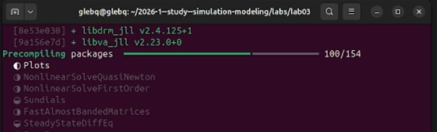
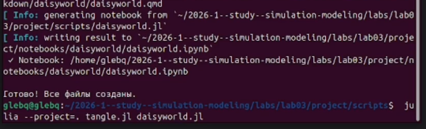
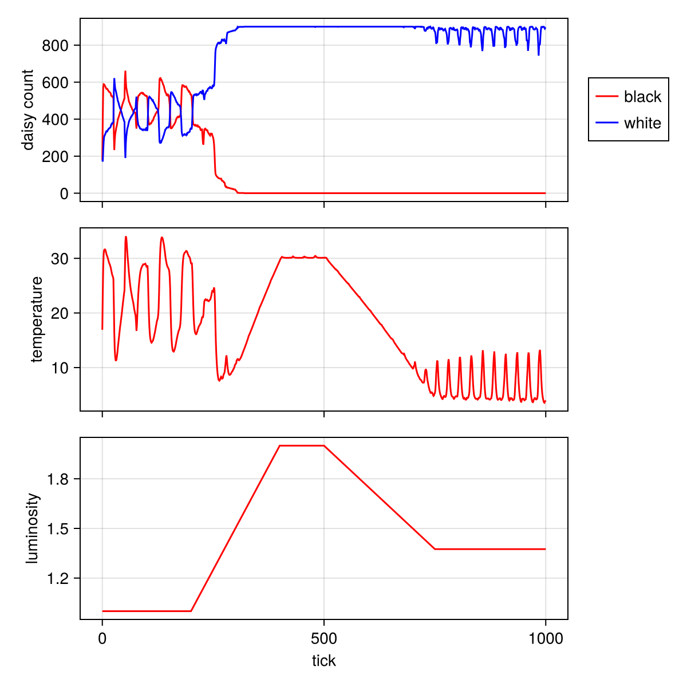

# Информация

## Докладчик

:::::::::::::: {.columns align=center}
::: {.column width="70%"}

  * Глеб Б.
  * Студент
  * Российский университет дружбы народов им. П. Лумумбы
  * [glebb2005@mail.ru](mailto:glebb2005@mail.ru)

:::
::: {.column width="30%"}

:::
::::::::::::::

# Вводная часть

## Актуальность

- Агентное моделирование позволяет исследовать сложные системы снизу вверх
- Модель Daisyworld наглядно демонстрирует принципы саморегуляции
- Понимание механизмов обратной связи важно для экологии и климатологии

## Объект и предмет исследования

- **Объект:** агентная модель Daisyworld (Мир маргариток)
- **Предмет:** динамика численности маргариток и температуры при изменении параметров модели

## Цели и задачи

**Цель:** Изучить основы агентного моделирования на примере модели Daisyworld.

**Задачи:**
1. Реализовать модель Daisyworld с использованием Agents.jl
2. Провести визуализацию и анализ динамики модели
3. Выполнить параметрическое исследование
4. Оформить результаты в виде отчёта и презентации

## Материалы и методы

- Язык программирования Julia
- Пакет Agents.jl для агентного моделирования
- CairoMakie для визуализации
- Literate.jl для литературного программирования

# Содержание исследования

## Модель Daisyworld

- Чёрные и белые маргаритки растут на клеточной сетке
- Разное альбедо влияет на локальную температуру
- Температура влияет на размножение
- Маргаритки стареют и умирают
- Система способна к саморегуляции

## Настройка окружения

## Литературное программирование

Все скрипты преобразованы в литературный стиль с помощью Literate.jl. Сгенерированы:
- Чистый код
- Jupyter Notebook
- Quarto-документ

## Визуализация модели

Комплексный график динамики модели:

На графике показаны:
- Численность чёрных и белых маргариток
- Изменение средней температуры
- Изменение солнечной светимости

## Анализ результатов

- При увеличении светимости белые маргаритки доминируют, охлаждая планету
- При снижении светимости активизируются чёрные маргаритки, поглощающие тепло
- Система поддерживает температуру в диапазоне, благоприятном для жизни

# Результаты

## Основные итоги

1. Реализована модель Daisyworld с использованием Agents.jl
2. Проведена визуализация динамики численности и температуры
3. Выполнено параметрическое исследование
4. Освоены инструменты литературного программирования

## Демонстрация работы

- Модель успешно запускается на 1000+ шагов
- Графики сохраняются в каталог plots/
- Сгенерированы Jupyter Notebook и Quarto-документы

# Выводы

## Заключение

Модель Daisyworld наглядно демонстрирует:
- Способность биологических систем к саморегуляции
- Влияние живых организмов на окружающую среду
- Принципы обратной связи в сложных системах

**Главный вывод:** Даже простые правила поведения агентов могут приводить к сложному и устойчивому глобальному поведению системы.

# Рекомендации

## Принципы создания агентных моделей

- Начинайте с простых правил для агентов
- Визуализируйте результаты на каждом этапе
- Проводите параметрический анализ
- Используйте литературное программирование для документирования

## Использованные инструменты

| Инструмент | Назначение |
|------------|------------|
| Julia | Язык программирования |
| Agents.jl | Агентное моделирование |
| CairoMakie | Визуализация |
| Literate.jl | Литературное программирование |
| Quarto | Подготовка отчётов и презентаций |
