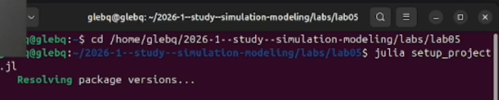

---
## Author
author:
  name: Беспутин Глеб Антонович
  email: glebb2005@mail.ru
  affiliation:
    - name: Российский университет дружбы народов
      country: Российская Федерация
      city: Москва
      address: ул. Миклухо-Маклая, д. 6

## Title
title: "Лабораторная работа №5"
subtitle: "Имитационное моделирование: Сети Петри"
license: "CC BY"
---

# Цель работы

Изучить аппарат сетей Петри для моделирования дискретных систем. На примере задачи об обедающих философах исследовать проблему взаимной блокировки (deadlock) и способы её предотвращения с использованием арбитра.

# Задание

1. Создать рабочий каталог для кода лабораторной работы.
2. Установить необходимые пакеты.
3. Выполнить предложенный код моделирования сетей Петри.
4. Преобразовать код в литературный стиль.
5. Сгенерировать чистый код, Jupyter Notebook и Quarto-документ.
6. Выполнить код из Jupyter Notebook.
7. Провести параметрическое исследование для различного числа философов.
8. Интегрировать полученные результаты в отчёт.

# Теоретическое введение

## Сети Петри

Сеть Петри представляет собой математический аппарат для моделирования дискретных систем. Графически она изображается как двудольный ориентированный граф с двумя типами вершин:

- **Позиции** (круги) — пассивные элементы, описывающие состояние системы.
- **Переходы** (прямоугольники) — активные элементы, моделирующие события.
- **Фишки** (точки внутри позиций) — обозначают количество ресурсов или выполнение условия.

Правило срабатывания перехода: переход разрешён, если во всех его входных позициях достаточно фишек. При срабатывании фишки из входных позиций удаляются, а в выходные добавляются.

## Задача об обедающих философах

Задача сформулирована Эдсгером Дейкстрой в 1965 году. За круглым столом сидят N философов, между соседями лежит одна вилка. Для еды философу нужны две вилки — левая и правая. При наивной реализации (каждый берёт левую вилку, затем правую) возникает взаимная блокировка (deadlock): все берут левую вилку и ждут правую.

## Методы предотвращения deadlock

- **Арбитр** — вводится дополнительная позиция, разрешающая есть не более чем N-1 философам одновременно.
- **Асимметричное правило** — нечётные философы берут левую вилку первой, чётные — правую.
- **Атомарный захват** — философ берёт обе вилки одновременно или ни одной.

# Выполнение лабораторной работы

## Настройка рабочего окружения

Был создан проект DrWatson и установлены необходимые пакеты: DrWatson, OrdinaryDiffEq, Plots, DataFrames, CSV, Random.

## Литературное программирование

Все скрипты модели были преобразованы в литературный стиль. Для каждого скрипта сгенерированы чистый код, Jupyter Notebook и Quarto-документ.

## Базовый эксперимент: классическая модель

Запущена классическая модель для N=5 философов. Стохастическое моделирование (алгоритм Гиллеспи) на интервале tmax=50.0 показало возникновение deadlock.

На графике видно, что через некоторое время все философы оказываются в состоянии Hungry, и ни один переход больше не срабатывает — система заблокирована.

## Модель с арбитром

Запущена модифицированная модель с арбитром для N=5 философов. Арбитр содержит N-1=4 фишки, что предотвращает одновременный захват вилок всеми философами.

Система продолжает работать бесконечно долго, философы поочерёдно получают доступ к вилкам и принимают пищу. Deadlock не обнаружен.

## Параметрическое исследование

Проведено исследование для различного числа философов N ∈ {3, 5, 7}. Результаты сведены в таблицу.

| N | tmax | Deadlock (классическая) | Deadlock (арбитр) |
|---|------|------------------------|-------------------|
| 3 | 30.0 | да                     | нет               |
| 5 | 50.0 | да                     | нет               |
| 7 | 70.0 | да                     | нет               |

Во всех случаях классическая модель приводит к deadlock, тогда как модель с арбитром работает корректно.

## Анимация процесса

Создана анимация динамики классической сети для N=3 философов, наглядно демонстрирующая перемещение фишек и возникновение deadlock.

# Выводы

В ходе выполнения лабораторной работы были достигнуты следующие результаты:

1. Реализована модель сетей Петри для задачи об обедающих философах.

2. Обнаружена взаимная блокировка (deadlock) в классической постановке задачи.

3. Реализован механизм арбитра, успешно предотвращающий deadlock.

4. Проведено параметрическое исследование для различного числа философов.

5. Создана анимация, визуализирующая динамику сети.

6. Освоены инструменты литературного программирования в Julia.

Сети Петри являются мощным инструментом для моделирования параллельных и распределённых систем. Задача об обедающих философах наглядно демонстрирует проблемы синхронизации и способы их решения.









# Список литературы{.unnumbered}

1. Д. С. Кулябов, А. В. Королькова. Имитационное моделирование. Практикум. — 2024.
2. Petri C. A. Kommunikation mit Automaten. — Bonn: Institut für Instrumentelle Mathematik, 1962.
3. Dijkstra E. W. Cooperating Sequential Processes // Technological University, Eindhoven. — 1965.
