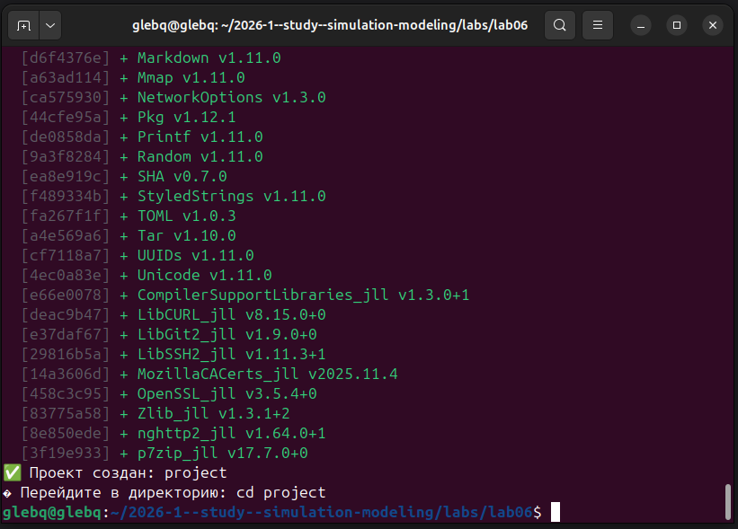
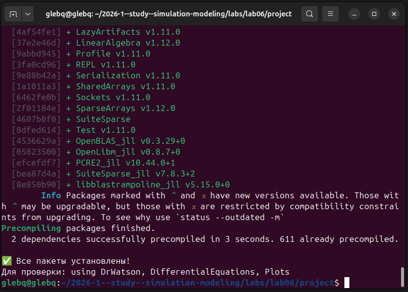

# Информация

## Докладчик

:::::::::::::: {.columns align=center}
::: {.column width="70%"}

  * Глеб Б.
  * Студент
  * Российский университет дружбы народов им. П. Лумумбы
  * [glebb2005@mail.ru](mailto:glebb2005@mail.ru)

:::
::: {.column width="30%"}

:::
::::::::::::::

# Вводная часть

## Актуальность

- Эпидемиологическое моделирование критически важно для прогнозирования распространения инфекций

- Модель SIR — базовая модель, лежащая в основе многих современных эпидемиологических исследований

- Сети Петри предоставляют удобный формализм для описания компартментных моделей

- Сочетание детерминированного и стохастического подходов позволяет оценить роль случайности

## Объект и предмет исследования

- **Объект:** сети Петри как математический аппарат моделирования динамических систем

- **Предмет:** модель эпидемии SIR (Susceptible–Infectious–Recovered) и её поведение при различных параметрах

## Цели и задачи

**Цель:** Освоить реализацию эпидемиологических моделей с использованием аппарата сетей Петри.

**Задачи:**

1. Реализовать сеть Петри для модели SIR с переходами infection и recovery

2. Выполнить детерминированное моделирование (решение ОДУ)

3. Выполнить стохастическое моделирование (алгоритм Гиллеспи)

4. Сравнить два подхода к моделированию

5. Исследовать чувствительность модели к параметру β

6. Провести параметрическое исследование для различных сценариев

## Материалы и методы

- Язык программирования Julia

- AlgebraicPetri для построения сетей Петри

- OrdinaryDiffEq (метод Tsit5) для решения ОДУ

- Алгоритм Гиллеспи для стохастического моделирования

- Plots для визуализации

- DrWatson для управления проектом

- Literate.jl для литературного программирования

# Содержание исследования

## Модель SIR

Модель описывает три состояния популяции:

- **S** (Susceptible) — восприимчивые, могут заразиться

- **I** (Infectious) — инфицированные, распространяют инфекцию

- **R** (Recovered) — выздоровевшие, имеют иммунитет

Переходы в сети Петри:

- **infection:** S + I → I + I (скорость β)

- **recovery:** I → R (скорость γ)

## Сеть Петри для модели SIR

Два перехода, три позиции. Начальная маркировка: S₀ = 990, I₀ = 10, R₀ = 0.

Закон действующих масс определяет скорости:

- infection_rate = β·S·I

- recovery_rate = γ·I

## Два подхода к моделированию

**Детерминированный подход:**

- Система ОДУ: dS/dt = –βSI, dI/dt = βSI – γI, dR/dt = γI

- Численное решение методом Tsit5

- Даёт гладкую усреднённую динамику

**Стохастический подход:**

- Алгоритм Гиллеспи (прямой метод SSA)

- Учитывает дискретность событий и случайные флуктуации

- Особенно важен при малых размерах популяции

## Настройка окружения

## Литературное программирование

Все скрипты преобразованы в литературный стиль. Сгенерированы:

- Чистый код (`.jl`)

- Jupyter Notebook (`.ipynb`)

- Quarto-документ (`.qmd`)

Параметризованная версия также подготовлена.

## Детерминированная симуляция

Результаты:

- Классический пик эпидемии: рост I, максимум, спад до нуля

- S монотонно убывает, выходит на плато

- R монотонно растёт, выходит на плато

- Пик I ≈ 237 при t ≈ 18

## Стохастическая симуляция

Результаты:

- Траектория близка к детерминированной

- Присутствуют небольшие случайные флуктуации

- При большом размере популяции (1000) разброс невелик

## Сравнение подходов

- Стохастическая кривая колеблется вокруг детерминированной

- Пик и время спада совпадают

- При малых размерах популяции различия были бы значительнее

- Оба подхода дополняют друг друга

## Сканирование параметра β

Исследование диапазона β ∈ [0.1, 0.8] с шагом 0.05:

- **Пороговое явление:** при β ≤ 0.15 эпидемия не возникает

- С ростом β пик I резко возрастает

- При больших β практически вся популяция переболевает

- Конечное R также растёт с β, но медленнее

## Параметрическое исследование

Три сценария эпидемии:

| β   | γ   | Сценарий           | Пик I   | Конечное R |
|-----|-----|--------------------|---------|------------|
| 0.2 | 0.1 | Слабая эпидемия    | 157.1   | 318.7      |
| 0.3 | 0.1 | Умеренная эпидемия | 236.2   | 800.9      |
| 0.5 | 0.1 | Сильная эпидемия   | 361.5   | 974.4      |

## Сравнительная динамика сценариев

- При β = 0.2 — эпидемия слабая, многие остаются восприимчивыми

- При β = 0.3 — классическое течение с выраженным пиком

- При β = 0.5 — быстрый рост, высокий пик, почти все переболевают

## Анализ результатов

**Пороговое поведение (эпидемиологический порог):**

- Базовое репродуктивное число R₀ = β·S₀/γ

- Если R₀ > 1 — эпидемия развивается

- Если R₀ < 1 — эпидемия затухает

- Для β = 0.3: R₀ = 0.3·990/0.1 = 2970 ≫ 1

## Сравнение с другими подходами

**Сети Петри vs Системы ОДУ:**

- Сети Петри — наглядное графическое представление

- Автоматическая генерация ОДУ из структуры сети

- Возможность стохастического моделирования

**Сети Петри vs Агентное моделирование:**

- Сети Петри — компартментный подход, популяционный уровень

- Агентное моделирование — индивидуальный уровень

# Результаты

## Основные итоги

1. Реализована сеть Петри для модели SIR с переходами infection и recovery

2. Выполнено детерминированное моделирование (решение ОДУ методом Tsit5)

3. Выполнено стохастическое моделирование (алгоритм Гиллеспи)

4. Проведено сравнение двух подходов

5. Исследована чувствительность модели к параметру β (пороговое явление)

6. Проведено параметрическое исследование для трёх сценариев

7. Освоены инструменты литературного программирования

## Демонстрация работы

- Модель успешно запускается для различных параметров β и γ

- Графики сохраняются в каталог plots/

- Результаты моделирования сохраняются в CSV-файлы

- Сгенерированы Jupyter Notebook и Quarto-документы

- Параметризованная версия позволяет легко менять условия эксперимента

# Выводы

## Заключение

Сети Петри в эпидемиологическом моделировании обеспечивают:

- Наглядное представление компартментных моделей

- Естественный переход к системам ОДУ (закон действующих масс)

- Возможность стохастического моделирования (алгоритм Гиллеспи)

- Удобство параметрических исследований

**Главный вывод:** Формализм сетей Петри в сочетании с детерминированным и стохастическим подходами предоставляет мощный инструментарий для моделирования и анализа эпидемиологических процессов, позволяя оценивать как среднюю динамику, так и роль случайных факторов.

# Рекомендации

## Применение подхода

- Моделирование эпидемий с более сложной структурой (SEIR, SEIRS)

- Учёт пространственной структуры популяции

- Добавление вакцинации и карантинных мер

- Моделирование распространения информации в социальных сетях

- Экологические модели (хищник–жертва)

## Использованные инструменты

| Инструмент | Назначение |
|------------|------------|
| Julia | Язык программирования |
| AlgebraicPetri | Построение сетей Петри |
| Catlab | Теория категорий, Graphviz |
| OrdinaryDiffEq | Решение дифференциальных уравнений |
| Plots | Визуализация |
| DataFrames | Работа с табличными данными |
| DrWatson | Управление проектом |
| Literate.jl | Литературное программирование |
| Quarto | Подготовка отчётов и презентаций |
