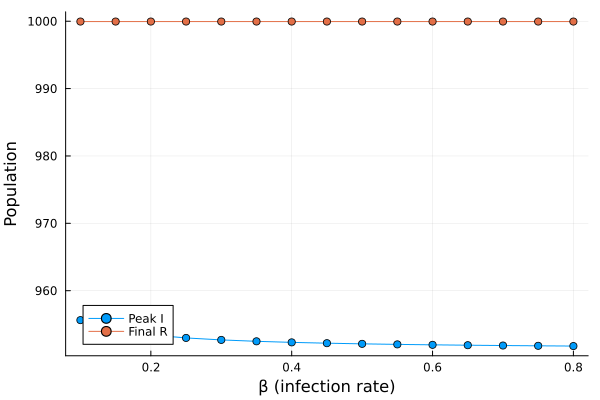
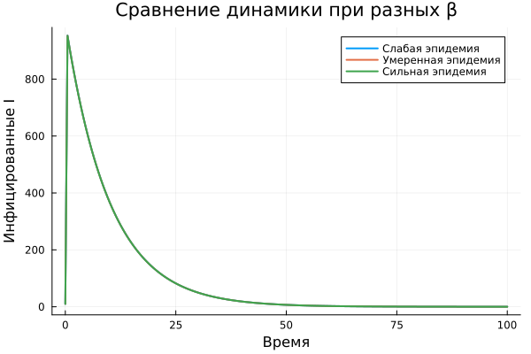

---
## Author
author:
  name: Беспутин Глеб Антонович
  email: glebb2005@mail.ru
  affiliation:
    - name: Российский университет дружбы народов
      country: Российская Федерация
      city: Москва
      address: ул. Миклухо-Маклая, д. 6

## Title
title: "Лабораторная работа №6"
subtitle: "Имитационное моделирование: реализация основных моделей в подходе сетей Петри"
license: "CC BY"
---

# Цель работы

Освоить реализацию базовых эпидемиологических моделей с использованием аппарата сетей Петри. На примере модели SIR (Susceptible–Infectious–Recovered) изучить детерминированный и стохастический подходы к моделированию, а также исследовать чувствительность модели к изменению параметров.

# Задание

1. Создать рабочий каталог для кода лабораторной работы.
2. Установить необходимые пакеты.
3. Выполнить предложенный код модели SIR на сетях Петри.
4. Преобразовать код в литературный стиль.
5. Сгенерировать чистый код, Jupyter Notebook и Quarto-документ.
6. Выполнить код из Jupyter Notebook.
7. Провести параметрическое исследование для набора параметров β и γ.
8. Интегрировать полученные результаты в отчёт.

# Теоретическое введение

## Сети Петри в эпидемиологическом моделировании

Сеть Петри — математический аппарат для моделирования дискретных систем, широко применяемый в биоинформатике и эпидемиологии. Основные элементы:

- **Позиции** (круги) — компартменты модели (S, I, R).
- **Переходы** (прямоугольники) — события (заражение, выздоровление).
- **Фишки** (точки) — индивиды в популяции.
- **Скорости переходов** — задают интенсивность событий (β, γ).

## Модель SIR

Модель SIR (Kermack–McKendrick, 1927) описывает распространение инфекции в популяции. Выделяют три группы:

- **S** (Susceptible) — восприимчивые, могут заразиться.
- **I** (Infectious) — инфицированные, распространяют инфекцию.
- **R** (Recovered) — выздоровевшие, имеют иммунитет.

Переходы в модели:

- **Заражение**: S + I → I + I (скорость β).
- **Выздоровление**: I → R (скорость γ).

Поведение модели описывается системой дифференциальных уравнений (закон действующих масс):

- dS/dt = –β·S·I
- dI/dt = β·S·I – γ·I
- dR/dt = γ·I

## Два подхода к моделированию

- **Детерминированный** — решение системы ОДУ, даёт гладкую усреднённую динамику.
- **Стохастический** — алгоритм Гиллеспи (прямой метод SSA), учитывает случайные флуктуации.

При большом размере популяции траектории близки; при малом — стохастический подход показывает существенный разброс.

# Выполнение лабораторной работы

## Настройка рабочего окружения

Был создан проект DrWatson и установлены необходимые пакеты: AlgebraicPetri, Catlab, OrdinaryDiffEq, Plots, DataFrames, CSV, Random.

## Литературное программирование

Все скрипты модели были преобразованы в литературный стиль в формате Literate.jl. Для каждого скрипта сгенерированы:

- чистый код (`.jl`);
- Jupyter Notebook (`.ipynb`);
- документация Quarto (`.qmd`).

## Базовый эксперимент: модель SIR

Запущена модель SIR с параметрами β = 0.3, γ = 0.1, начальной численностью S₀ = 990, I₀ = 10, R₀ = 0, время моделирования tmax = 100.

### Детерминированная симуляция

Детерминированное моделирование методом Tsit5 показало классическую динамику эпидемии: плавный рост числа инфицированных до пика, затем спад до нуля; число восприимчивых монотонно убывает, число выздоровевших выходит на плато.

### Стохастическая симуляция

Стохастическое моделирование алгоритмом Гиллеспи с зерном 123 показало близкую к детерминированной траекторию с небольшими флуктуациями, что ожидаемо при большом размере популяции.

### Сравнение детерминированного и стохастического подходов

Совмещение графиков числа инфицированных I(t) для двух подходов демонстрирует хорошее согласие: стохастическая кривая колеблется вокруг детерминированной, пик и время спада совпадают.

## Сканирование параметра β

Проведено исследование чувствительности модели к изменению коэффициента заражения β в диапазоне от 0.1 до 0.8 с шагом 0.05 при фиксированном γ = 0.1.

Результаты показывают пороговое явление:
- При малых β (≤ 0.15) эпидемия затухает (peak I ≈ 0).
- С ростом β пик заболеваемости резко возрастает.
- При больших β эпидемия охватывает почти всю популяцию.

## Параметрическое исследование

Проведено исследование для трёх сценариев эпидемии. Результаты сведены в таблицу.

| β   | γ   | Сценарий           | Пик I   | Конечное R |
|-----|-----|--------------------|---------|------------|
| 0.2 | 0.1 | Слабая эпидемия    | 157.1   | 318.7      |
| 0.3 | 0.1 | Умеренная эпидемия | 236.2   | 800.9      |
| 0.5 | 0.1 | Сильная эпидемия   | 361.5   | 974.4      |

# Выводы

В ходе выполнения лабораторной работы были достигнуты следующие результаты:

1. Реализована модель SIR на основе формализма сетей Петри с двумя переходами: infection и recovery.

2. Выполнено детерминированное моделирование путём решения системы ОДУ и стохастическое моделирование алгоритмом Гиллеспи.

3. Проведено сравнение двух подходов: при большом размере популяции траектории близки, стохастическая демонстрирует ожидаемые флуктуации.

4. Исследована чувствительность модели к параметру β: обнаружено пороговое поведение, характерное для модели SIR.

5. Проведено параметрическое исследование для различных сценариев эпидемии.

6. Освоены инструменты литературного программирования в Julia (Literate.jl, Quarto).

Сети Петри в сочетании с законом действующих масс предоставляют удобный формализм для моделирования эпидемиологических процессов. Детерминированный подход даёт усреднённую картину, стохастический — позволяет оценить роль случайности, что особенно важно при малых размерах популяции.









# Список литературы{.unnumbered}

1. Kermack W. O., McKendrick A. G. A Contribution to the Mathematical Theory of Epidemics // Proceedings of the Royal Society A. — 1927. — Vol. 115, no. 772. — P. 700–721.
2. Gillespie D. T. Exact Stochastic Simulation of Coupled Chemical Reactions // The Journal of Physical Chemistry. — 1977. — Vol. 81, no. 25. — P. 2340–2361.
3. Д. С. Кулябов, А. В. Королькова. Имитационное моделирование. Практикум. — 2024.
4. Petri C. A. Kommunikation mit Automaten. — Bonn: Institut für Instrumentelle Mathematik, 1962.
