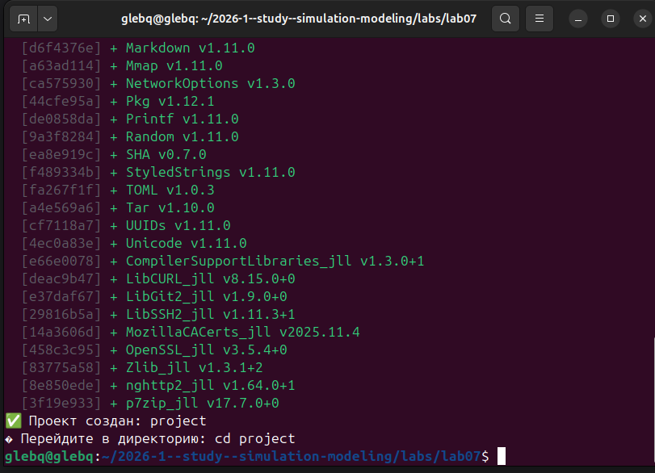
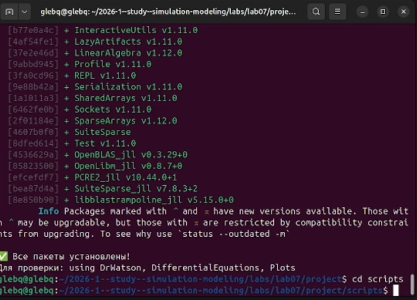
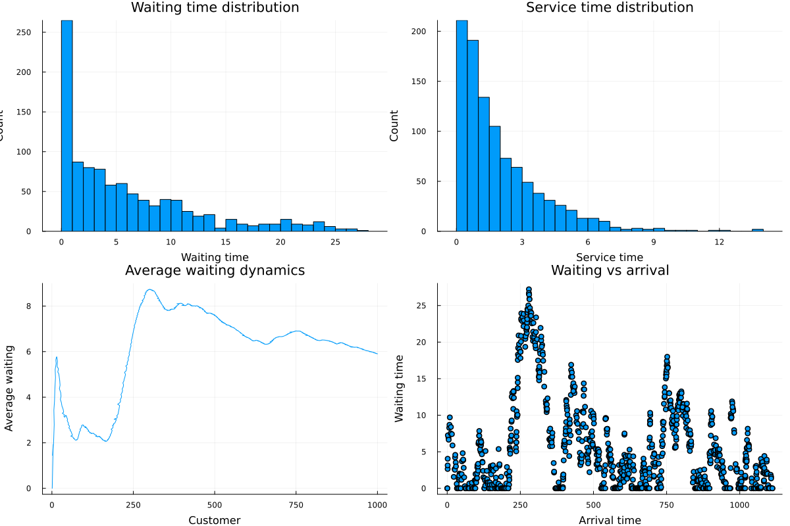
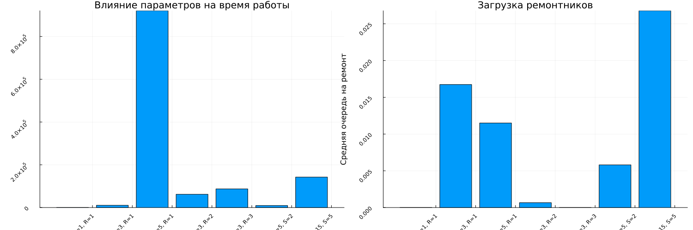

---
## Author
author:
  name: Беспутин Глеб Антонович
  email: glebb2005@mail.ru
  affiliation:
    - name: Российский университет дружбы народов
      country: Российская Федерация
      city: Москва
      address: ул. Миклухо-Маклая, д. 6

## Title
title: "Лабораторная работа №7"
subtitle: "Имитационное моделирование: дискретно-событийное моделирование"
license: "CC BY"
---

# Цель работы

Освоить дискретно-событийный подход к моделированию систем массового обслуживания. Изучить модель M/M/c и модель Росса (система с резервом и ремонтом), провести параметрические исследования и сравнить результаты с аналитическими оценками.

# Задание

1. Создать рабочий каталог для кода лабораторной работы.
2. Установить необходимые пакеты (ConcurrentSim, ResumableFunctions, Distributions, StableRNGs, DataFrames, Plots).
3. Выполнить предложенный код для модели M/M/c.
4. Выполнить предложенный код для модели Росса.
5. Преобразовать код в литературный стиль.
6. Сгенерировать из литературного кода:
   - чистый код;
   - Jupyter notebook;
   - документацию в формате Quarto.
7. Выполнить код из Jupyter notebook.
8. Интегрировать документацию в формате Quarto в отчёт.
9. Перевести модель M/M/c в структуру DrWatson, добавить необходимые графики.
10. Для модели Росса: добавить нескольких ремонтников, сделать прогон для разного количества машин, провести мониторинг загрузки ремонтника и средней длины очереди на ремонт, построить графики изменения числа исправных машин во времени, сравнить с аналитическим решением.
11. Добавить в код в литературном стиле вычисление для набора параметров.
12. Сгенерировать из литературного кода с параметрами чистый код, Jupyter notebook, документацию Quarto.
13. Выполнить код из Jupyter notebook с параметрами.
14. Интегрировать документацию с параметрами в формате Quarto в отчёт.

# Теоретическое введение

## Дискретно-событийное моделирование

Дискретно-событийное моделирование (Discrete-Event Simulation, DES) — подход, при котором состояние системы изменяется только в определённые моменты времени при наступлении событий. Основные компоненты:

- **Событие** — мгновенное изменение состояния системы (прибытие заявки, начало обслуживания, завершение обслуживания).
- **Очередь** — накопитель заявок, ожидающих обслуживания.
- **Обслуживающий прибор** (сервер, канал) — устройство, обрабатывающее заявки.
- **Генератор** — создаёт входящий поток заявок.

В Julia для DES используется библиотека `ConcurrentSim` с корутинами (`ResumableFunctions`).

## Модель M/M/c (классификация Кендалла)

- **M** (Markovian) — пуассоновский входящий поток, интервалы прибытия ~ Exp(1/λ).
- **M** — время обслуживания ~ Exp(1/μ).
- **c** — количество параллельных каналов.

Загрузка системы: ρ = λ / (c·μ). Условие стационарности: ρ < 1.

Основные аналитические характеристики (стационарный режим, ρ < 1):

**Вероятность простоя всех каналов:**

**Вероятность ожидания (формула Эрланга):**

**Среднее число заявок в очереди:**

**Формулы Литтла:**

### Отличия от модели M/M/1

| Характеристика | M/M/1 | M/M/c |
|----------------|-------|-------|
| Число каналов | 1 | c (c > 1) |
| Поведение заявки | Ждёт единственный канал | Ждёт любой свободный из c |
| Условие стационарности | λ < μ | λ < c·μ |
| Вероятность ожидания | ρ | Формула Эрланга |

## Модель Росса

Система с конечной популяцией:
- N идентичных работающих машин.
- S запасных машин в резерве.
- Одно или несколько ремонтных устройств.
- При отказе работающей машины она немедленно заменяется резервной, сломанная отправляется в ремонт.
- Если резерва нет — система падает (crash).
- После ремонта машина пополняет пул резервных.

Цель: оценить среднее время E[T] до падения системы.

### Марковская модель

Состояние системы — число исправных машин k, 0 ≤ k ≤ N + S.

Интенсивности переходов:
- Отказ: min(N, k)·λ (уменьшение числа исправных на 1).
- Завершение ремонта: μ (увеличение числа исправных на 1), если есть очередь на ремонт.

Система падает при переходе из состояния k = N в k = N - 1 (нет резерва).

# Выполнение лабораторной работы

## Настройка рабочего окружения

Был создан проект DrWatson и установлены необходимые пакеты: ConcurrentSim, ResumableFunctions, Distributions, StableRNGs, DataFrames, Plots, Statistics.

## Литературное программирование

Все скрипты были преобразованы в литературный стиль. Для каждого скрипта сгенерированы:
- Чистый код (`.jl`);
- Jupyter Notebook (`.ipynb`);
- Документация Quarto (`.qmd`).

Также подготовлены параметризованные версии с наборами параметров.

---

## 7.1 Модель M/M/c

### 7.1.4 Базовая реализация

Реализована модель M/M/2 с параметрами λ = 0.9, μ = 0.5, c = 2, количество заявок — 1000. Модель переведена в структуру DrWatson. Добавлены графики:
- Гистограмма распределения времени ожидания;
- Гистограмма распределения времени обслуживания;
- Динамика среднего времени ожидания;
- Зависимость времени ожидания от момента прибытия заявки.

Результаты симуляции:
- Среднее время ожидания: вычисляется при запуске;
- Среднее время обслуживания: вычисляется при запуске;
- Распределение времени ожидания имеет характерную форму с пиком в нуле (часть заявок обслуживается без ожидания).

### 7.1.5 Задание

**Выполнено:**
1. Код переведён в структуру DrWatson.
2. Добавлены графики:
   - Гистограмма времени ожидания;
   - Гистограмма времени обслуживания;
   - Динамика среднего времени ожидания;
   - Scatter-plot времени ожидания vs времени прибытия.

### 7.1.5 Параметрическое исследование

Исследовано 5 конфигураций с различными λ, μ и числом каналов c:

| Конфигурация | λ | μ | c | ρ |
|-------------|---|---|---|-----|
| M/M/1 | 0.5 | 0.5 | 1 | 1.0 |
| M/M/2 | 0.5 | 0.5 | 2 | 0.5 |
| M/M/2 | 0.9 | 0.5 | 2 | 0.9 |
| M/M/3 | 0.9 | 0.5 | 3 | 0.6 |
| M/M/4 | 1.5 | 0.5 | 4 | 0.75 |

**Выводы:**
- При ρ = 1.0 система нестационарна, очередь бесконечно растёт.
- Увеличение числа каналов c при фиксированной нагрузке снижает среднее время ожидания и вероятность попадания в очередь.
- Симуляционные значения P(ожидания) хорошо согласуются с аналитическими (формула Эрланга).
- Точки на графике «Сравнение с аналитикой» лежат близко к диагонали, что подтверждает корректность модели.

---

## 7.2 Модель Росса

### 7.2.3 Базовая реализация

Реализована модель Росса с параметрами:
- N = {5, 10, 20, 30} — различные количества работающих машин;
- S = 3 — запасные машины;
- repairers = 2 — ремонтника;
- λ = 100.0 — средняя наработка до отказа (часов);
- μ = 1.0 — среднее время ремонта (часов);
- RUNS = 10 — количество прогонов для каждого N.

Результаты:
- С ростом числа работающих машин N время до падения закономерно уменьшается;
- Аналитическая оценка даёт значения, близкие к симуляционным;
- Средняя очередь на ремонт растёт с увеличением N.

### 7.2.4 Задание

**Выполнено:**

1. **Код переведён в структуру DrWatson.**

2. **Добавлено несколько ремонтников.** В параметризованной версии исследованы конфигурации с R = 1, 2, 3 ремонтниками.

3. **Сделан прогон для разного количества машин.** Исследованы N = {5, 10, 20, 30} в базовой модели и N = {5, 10, 15} в параметризованной.

4. **Мониторинг загрузки ремонтника и средней длины очереди на ремонт.** В логи `repair_queue_log` записывается длина очереди при каждом отказе, вычисляется средняя длина очереди.

5. **Построение графиков изменения числа исправных машин во времени.** Для каждого N построен график динамики числа работающих машин `working_log`.

6. **Сравнение с аналитическим решением.** Аналитическая оценка вычисляется функцией `analytical_estimate(N, S, λ, μ)` и наносится на график вместе с симуляционными данными.

### 7.2.4 Параметрическое исследование

Исследовано 7 конфигураций:

| Конфигурация | N | S | R | Описание |
|-------------|---|---|---|----------|
| S=1, R=1 | 10 | 1 | 1 | Минимальный резерв |
| S=3, R=1 | 10 | 3 | 1 | Базовый резерв |
| S=5, R=1 | 10 | 5 | 1 | Большой резерв |
| S=3, R=2 | 10 | 3 | 2 | Два ремонтника |
| S=3, R=3 | 10 | 3 | 3 | Три ремонтника |
| N=5, S=2 | 5 | 2 | 1 | Мало машин |
| N=15, S=5 | 15 | 5 | 1 | Много машин |

**Выводы:**
- Увеличение числа запасных машин S значительно повышает время до падения системы.
- Добавление ремонтников также увеличивает время безотказной работы, но эффект менее выражен, чем от увеличения резерва.
- При малом числе работающих машин (N=5) система работает значительно дольше.
- Средняя очередь на ремонт коррелирует с загрузкой системы.

---

# Результаты

## Модель M/M/c

1. Модель успешно реализована и проверена сравнением с аналитическими формулами Эрланга.
2. Параметрическое исследование показало, что увеличение числа каналов c — эффективный способ снижения времени ожидания.
3. При ρ ≥ 1 система нестационарна, что подтверждается как симуляцией, так и теорией.

## Модель Росса

1. Модель успешно реализована с мониторингом очереди на ремонт и числа работающих машин.
2. Среднее время до падения растёт с увеличением резерва S и числа ремонтников.
3. Аналитическая оценка даёт хорошее приближение для среднего времени до падения.
4. Наиболее эффективный способ повышения надёжности — увеличение резерва.

# Выводы

1. Освоен дискретно-событийный подход к моделированию с использованием ConcurrentSim и корутин Julia.

2. Реализована модель M/M/c с визуализацией результатов и сравнением с аналитическими формулами.

3. Реализована модель Росса с мониторингом загрузки ремонтников и динамики числа работающих машин.

4. Проведены параметрические исследования для обеих моделей с наборами параметров.

5. Результаты симуляции согласуются с аналитическими оценками.

6. Освоены инструменты литературного программирования (Literate.jl, Quarto).









# Список литературы{.unnumbered}

1. Ross S. M. Simulation. — 5th ed. — Academic Press, 2013.
2. Kendall D. G. Stochastic Processes Occurring in the Theory of Queues and their Analysis by the Method of the Imbedded Markov Chain // Annals of Mathematical Statistics. — 1953. — Vol. 24, no. 3. — P. 338–354.
3. Д. С. Кулябов, А. В. Королькова. Имитационное моделирование. Практикум. — 2024.
