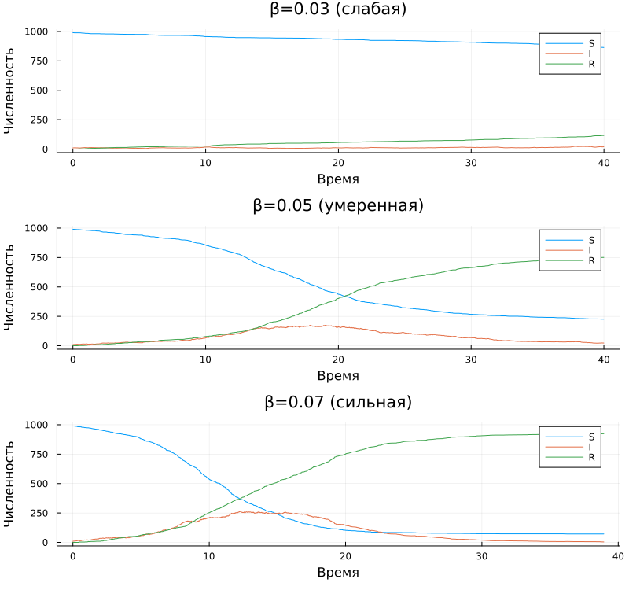

# Информация

## Докладчик

:::::::::::::: {.columns align=center}
::: {.column width="70%"}

  * Глеб Б.
  * Студент
  * Российский университет дружбы народов им. П. Лумумбы
  * [glebb2005@mail.ru](mailto:glebb2005@mail.ru)

:::
::: {.column width="30%"}

:::
::::::::::::::

# Вводная часть

## Актуальность

- Эпидемиологическое моделирование важно для прогнозирования инфекций
- Агентный подход даёт более детальную картину, чем ОДУ
- Дискретно-событийный подход позволяет моделировать каждого индивида
- Видны случайные флуктуации и редкие события (вымирание инфекции)

## Объект и предмет исследования

- **Объект:** дискретно-событийное моделирование
- **Предмет:** модель SIR с индивидуальными агентами

## Цели и задачи

**Цель:** Изучить дискретно-событийный подход на примере модели SIR.

**Задачи:**
1. Реализовать DES-модель SIR с агентами
2. Провести базовый эксперимент
3. Исследовать влияние параметра β
4. Оформить результаты в виде отчёта и презентации

## Материалы и методы

- Язык Julia
- ConcurrentSim + ResumableFunctions для DES
- Каждый индивид — отдельный процесс-корутина
- StatsPlots для визуализации
- DrWatson для управления проектом
- Literate.jl + Quarto для отчёта

# Содержание исследования

## Дискретно-событийный подход

- Время движется от события к событию
- Каждый агент — независимый процесс
- События: контакт, заражение, выздоровление
- Календарь событий управляется ConcurrentSim

## Модель SIR

Три состояния:
- **S** — восприимчивые
- **I** — инфицированные (распространители)
- **R** — выздоровевшие (иммунные)

## Жизненный цикл агента

Агент в состоянии :S:
- Ждёт случайное время ∼ Exp(1/c)
- Выбирает случайного собеседника
- Если собеседник :I — с вероятностью β заражается

Агент в состоянии :I:
- Ждёт время ∼ Exp(1/γ)
- Выздоравливает → :R

## Программный комплекс

Два файла:
- `src/sir_model.jl` — ядро: структуры, функции, логика
- `scripts/sir_des_literate.jl` — запуск и визуализация

## Базовый эксперимент

Параметры:
- β = 0.05, c = 10.0, γ = 0.25
- S₀ = 990, I₀ = 10, R₀ = 0
- tmax = 40

## Параметрическое исследование β

Три сценария:
- β = 0.03 — слабая эпидемия
- β = 0.05 — умеренная
- β = 0.07 — сильная

## Результаты сканирования β

| β | Пик I | Конечное R |
|---|-------|------------|
| 0.03 | низкий | мало |
| 0.05 | средний | средне |
| 0.07 | высокий | много |

С ростом β растут и пик, и доля переболевших.

## Сравнение с другими подходами

**DES vs ОДУ:**
- DES: стохастика, флуктуации, редкие события
- ОДУ: гладкая усреднённая динамика

**DES vs Гиллеспи:**
- DES: индивидуальный уровень, наглядно
- Гиллеспи: популяционный уровень, быстрее

# Результаты

## Основные итоги

1. Реализована DES-модель SIR с агентами
2. Воспроизведена классическая динамика эпидемии
3. Исследовано влияние β
4. Освоены ConcurrentSim и корутины Julia
5. Освоено литературное программирование

# Выводы

## Заключение

- DES даёт детальную картину эпидемии на уровне индивидов
- ConcurrentSim + корутины — удобный инструмент
- Параметр β критически влияет на тяжесть эпидемии
- Подход легко расширяется (SEIR, вакцинация, демография)

## Использованные инструменты

| Инструмент | Назначение |
|------------|------------|
| Julia | Язык программирования |
| ConcurrentSim | Ядро DES |
| ResumableFunctions | Корутины |
| Distributions | Случайные величины |
| DataFrames | Таблицы |
| StatsPlots | Графики |
| DrWatson | Проект |
| Literate.jl | Литературный код |
| Quarto | Отчёт и презентация |
