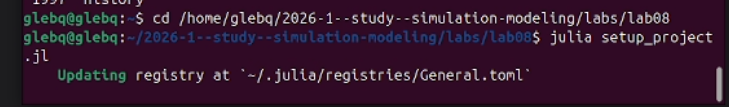
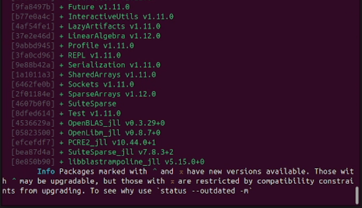
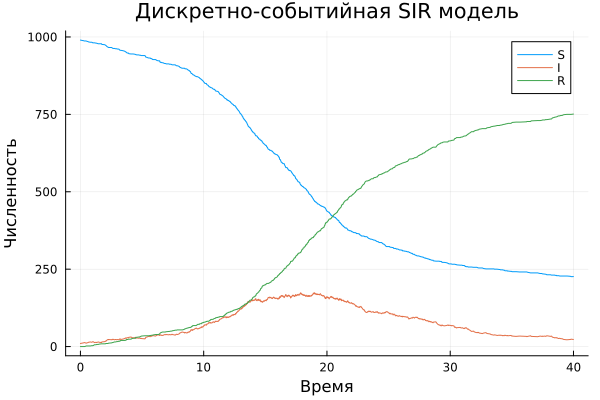

---
## Author
author:
  name: Беспутин Глеб Антонович
  email: glebb2005@mail.ru
  affiliation:
    - name: Российский университет дружбы народов
      country: Российская Федерация
      city: Москва
      address: ул. Миклухо-Маклая, д. 6

## Title
title: "Лабораторная работа №8"
subtitle: "Имитационное моделирование: реализация основных моделей в дискретно-событийном подходе"
license: "CC BY"
---

# Цель работы

Изучить дискретно-событийный подход к имитационному моделированию на примере классической модели распространения инфекции SIR. Реализовать стохастическую дискретно-событийную модель в виде программного комплекса на языке Julia. Провести анализ влияния параметров.

# Задание

1. Создать рабочий каталог для кода лабораторной работы.
2. Установить необходимые пакеты.
3. Выполнить предложенный код модели SIR в дискретно-событийном подходе.
4. Преобразовать код в литературный стиль.
5. Сгенерировать чистый код, Jupyter Notebook и Quarto-документ.
6. Выполнить код из Jupyter Notebook.
7. Провести параметрическое исследование для набора параметров β.
8. Интегрировать полученные результаты в отчёт.

# Теоретическое введение

## Дискретно-событийное моделирование

Дискретно-событийное моделирование (Discrete-Event Simulation, DES) — подход, при котором состояние системы изменяется только в определённые моменты времени при наступлении событий. В отличие от систем ОДУ, где время течёт непрерывно, здесь время продвигается скачками от события к событию.

Основные компоненты DES:
- **Событие** — мгновенное изменение состояния системы (заражение, выздоровление).
- **Календарь событий** — очередь будущих событий, упорядоченная по времени.
- **Процесс** — последовательность действий агента, которая может приостанавливаться в ожидании события.

В Julia для DES используется библиотека `ConcurrentSim` с корутинами (`ResumableFunctions`).

## Модель SIR

Модель SIR (Kermack–McKendrick, 1927) описывает распространение инфекции в популяции. Выделяют три группы:

- **S** (Susceptible) — восприимчивые, могут заразиться при контакте с инфицированным.
- **I** (Infectious) — инфицированные, являются распространителями инфекции.
- **R** (Recovered) — выздоровевшие, имеют иммунитет.

## Дискретно-событийная реализация SIR

В отличие от детерминированной модели (система ОДУ) и стохастической модели Гиллеспи (популяционный уровень), в дискретно-событийной реализации каждый индивид моделируется как отдельный агент со своим жизненным циклом:

- Восприимчивый индивид ожидает случайное время до следующего контакта (∼ Exp(1/c)).
- Выбирает случайного собеседника из популяции.
- Если собеседник инфицирован, с вероятностью β происходит заражение.
- Инфицированный ожидает время до выздоровления (∼ Exp(1/γ)), после чего переходит в R.

Такой подход позволяет наблюдать случайные флуктуации и эффекты, связанные с конечным размером популяции.

## Используемые библиотеки

- `ResumableFunctions` — создание корутин с помощью макроса `@resumable` и оператора `@yield`.
- `ConcurrentSim` — ядро DES: виртуальное время, планирование событий через `timeout`, запуск процессов через `@process`.
- `Distributions` — генерация случайных величин (экспоненциальное, равномерное).
- `DataFrames` — хранение и обработка результатов.
- `StatsPlots` — визуализация.

# Выполнение лабораторной работы

## Настройка рабочего окружения

Был создан проект DrWatson и установлены необходимые пакеты.

## Программный комплекс

Программный комплекс состоит из двух файлов:

- `src/sir_model.jl` — ядро модели: структуры данных, функции событий, логика агентов, управление симуляцией.
- `scripts/sir_des_literate.jl` — скрипт запуска в литературном стиле.

### Структуры данных

- `SIRPerson` — агент-индивид с полями `id` и `status` (:S, :I или :R).
- `SIRModel` — хранит всё состояние модели: объект симуляции, параметры (β, c, γ), временные ряды (ta, Sa, Ia, Ra), список всех индивидов.

### Жизненный цикл агента (функция `live`)

Каждый агент работает как независимый процесс:

1. Пока статус `:S`:
   - Ожидает случайное время ∼ Exp(1/c).
   - Выбирает случайного собеседника.
   - Если собеседник `:I`, с вероятностью β заражается и переходит в `:I`.
2. Если статус `:I`:
   - Ожидает время ∼ Exp(1/γ).
   - Выздоравливает и переходит в `:R`.

При каждом изменении состояния обновляются временные ряды S, I, R.

## Литературное программирование

Скрипты были преобразованы в литературный стиль. Сгенерированы чистый код, Jupyter Notebook и Quarto-документы.

## Базовый эксперимент

Запущена модель с параметрами:
- β = 0.05 (вероятность заражения)
- c = 10.0 (частота контактов)
- γ = 0.25 (интенсивность выздоровления)
- Начальные условия: S₀ = 990, I₀ = 10, R₀ = 0
- tmax = 40.0



На графике видна классическая динамика эпидемии: снижение S, рост I до пика с последующим спадом, монотонный рост R. В отличие от детерминированной модели, наблюдаются стохастические флуктуации, характерные для агентного подхода.

## Параметрическое исследование

Исследовано влияние параметра β (вероятность заражения). Три сценария:
- β = 0.03 (слабая эпидемия)
- β = 0.05 (умеренная эпидемия)
- β = 0.07 (сильная эпидемия)



Результаты показывают, что с ростом β:
- Пик заболеваемости увеличивается.
- Конечное число переболевших растёт.
- При малом β эпидемия может не развиться из-за стохастических эффектов.

# Выводы

1. Реализована дискретно-событийная модель SIR с использованием ConcurrentSim и корутин Julia.

2. Модель воспроизводит классическую динамику эпидемии со стохастическими флуктуациями.

3. Параметрическое исследование показало, что увеличение β приводит к более тяжёлому течению эпидемии.

4. Дискретно-событийный подход позволяет моделировать индивидуальное поведение агентов, что даёт более детальную картину по сравнению с популяционными моделями.

5. Освоены инструменты литературного программирования (Literate.jl, Quarto).

# Список литературы{.unnumbered}

1. Kermack W. O., McKendrick A. G. A Contribution to the Mathematical Theory of Epidemics // Proceedings of the Royal Society A. — 1927. — Vol. 115, no. 772. — P. 700–721.
2. Gillespie D. T. Exact Stochastic Simulation of Coupled Chemical Reactions // The Journal of Physical Chemistry. — 1977. — Vol. 81, no. 25. — P. 2340–2361.
3. Д. С. Кулябов, А. В. Королькова. Имитационное моделирование. Практикум. — 2024.